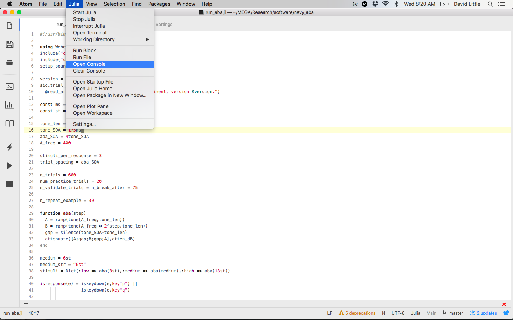

# About

Weber is a Julia package that can be used to generate simple psychology experiments that present visual and auditory stimuli at precise times. Julia is a recent programming language designed specifically for technical computing.

Weber's intended audience is graduate students in psychology and neuroscience, so it has been built with the assumption that its users have only minimal programming experience. The hope is that users should be able to get started right away making simple experiments.

Weber's emphasis is currently on auditory psychophysics, but the package has the features necessary to generate most visual stimuli one would desire as well, thanks to [Images.jl](https://github.com/JuliaImages/Images.jl). It is named after Ernst Weber. Weber runs on Windows and Mac OS X, and supports keyboard input or Cedrus response-pad input.

# Installation

The following instructions are designed for those new to Julia, and coding in general.

## 1. Install Julia and Juno

To use Weber you will need to have Julia, and an appropriate code editor installed. [Follow these instructions](https://github.com/JunoLab/uber-juno/blob/master/setup.md) to install Julia
and the Juno IDE. Juno is an extension for the code editor Atom (which these instructions will also ask you to download).

## 2. Install Weber

Once Julia and Juno are installed, open Atom. Go to "Open Console" under the Julia menu.



A console window will appear. Type `Pkg.add("Weber")` in the console and hit enter.


```@contents
Depth = 2
```
